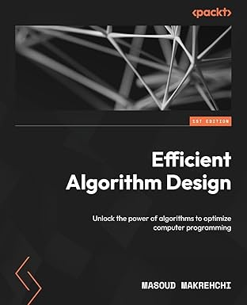

# Masoud Makrehchi  

_Ph.D, P.Eng, SMIEEE_  

Academic & Industry Leader · Generative AI, NLP, Machine Learning · Responsible Innovation & Strategy

---

## About Myself

I am Masoud Makrehchi, a researcher, educator, and team leader with deep expertise in Artificial Intelligence, Machine Learning, and Natural Language Processing. Since starting my PhD at the University of Waterloo in 2002 and finishing in 2007, I have built a career that spans both academia and industry, always trying to connect rigorous theory with meaningful real-world impact.

---

## Research Interests & Focus

My current work and interests include:

- **Large Language Models (LLMs) & Generative AI** – exploring their capacities, behaviors, and limits.
- **Responsible AI & Ethics** – balancing innovation with fairness, interpretability, and accountability.
- **Natural Language Processing (NLP)** – text representation, entity extraction, and taxonomy induction.
- **AI/ML in Legal & Financial Domains** – contracts, legal text analytics, and financial applications.
- **Moral AI Agents & Algorithm Design** – embedding normative behavior and constraints in autonomous systems.

---

## Academic & Professional Roles

- As a professor and mentor, I work with graduate and undergraduate students on projects that combine theoretical rigor with application relevance.
- As an advisor and collaborator, I help bridge the gap between research and deployment in academic and industry settings.
- My work includes peer-reviewed papers, conference presentations, and invited pieces, as well as surveys and curated reading lists in ML and NLP.
- I maintain public resources (reading lists, tools, and reflections) to encourage open discourse and knowledge sharing in AI.

---

## Philosophy & Vision

For me, working with generative models is not just a technical challenge but also a moral and societal one. I try to look at every model, experiment, and collaboration through a lens of responsibility: hopeful about the future of AI, but realistic about its risks and limits.

I see my role as a connector:

- between students and ideas  
- between academia and industry  
- between innovation and ethics  

My aim is to contribute to AI systems and knowledge that are not only advanced but also socially beneficial, transparent, and aligned with human values.

---

## Links

- [My Webpage](https://www.makrehchi.com)
- [My Publications](https://sites.google.com/site/makrehchi/publications)
- [LinkedIn](https://www.linkedin.com/in/masoud-makrehchi/)
- [Google Scholar](https://scholar.google.com/citations?user=StSRgHYAAAAJ&hl=en)
- [Medium](https://medium.com/@makrehchi)
- [GitHub](https://github.com/makrehchi)
- [My book on Amazon](https://www.amazon.com/Efficient-Algorithm-Design-algorithms-programming/dp/B0DJ93DLYT/ref=sr_1_1?crid=1PSTJ401EIMHA&dib=eyJ2IjoiMSJ9.qeS1WSGk88LGeBwPmc1cMHl_381Hag-Thh20keELiHlA9z_kKTO79Uxjbn0kFE77mbz58uI66soQR7NkELvtWvhLoCLUySVyzLxytTCD327OybDi6zkUs-EFJp0KMCziycH_wnTfAGMLHtUzoLXq_BfwgTW317CyQdbBVTpWEcO1QJZLWotCiOi1GPVAakPknlIggvvXJCdfziQ5ZLkzln9haQ2LksU6_CahvCDnoNk.trsqtNA1QDbwhr3qGd2ZHt10bugfH2ZQfnQvTEj2TD0&dib_tag=se&keywords=Efficient+Algorithm+Design&qid=1730959255&sprefix=efficient+algorithm+design%2Caps%2C486&sr=8-1)

- 

  
